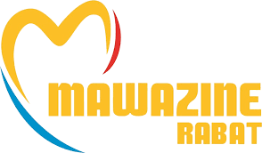

# MAWAZINE MUSIC FESTIVAL 2022

> This is an educational project to make a website for a music conference event with home page and about page.

## Built With

- HTML5, CSS3, JavaScript
- Linters:
  - Stylelint
  - Lighthouse
  - Webhint
  - ESLint

## Project Documentation
- Here is the [link](https://drive.google.com/file/d/1qMMEakDjja0_hg11AL611FLViCX57c5n/view?usp=sharing) to my Zoom video

## Website Mockup 📱 💻 🖥️

## Live Demo (if available)
[Capstone I : Mawazine Music Festival 2022](https://maaloum.github.io/Capstone-I/index.html)

👤 **Author**

- GitHub: [@Maaloum](https://github.com/maaloum)
- Twitter: [@Maaloum](https://twitter.com/maaloumely)
- LinkedIn: [LinkedIn](https://www.linkedin.com/in/ely-cheikh-maaloum-075a79135/)

## 🤝 Contributing

Contributions, issues, and feature requests are welcome!

Feel free to check the [issues page](../../issues/).

## Show your support

Give a ⭐️ if you like this project!
## Acknowledgments

- [Microverse](microverse.org)
- Code Reviewers
- Inspiration:
  - [Micheal](https://github.com/michael-duke/)
  - [mohamedck](https://github.com/mohamedck)
Under the [Creative Commons liscense](https://creativecommons.org/licenses/by-nc/4.0/)

Original design from [Cindy Shin in Behance](https://www.behance.net/gallery/29845175/CC-Global-Summit-2015)
## 📝 License

This project is [MIT](./MIT.md) licensed.
